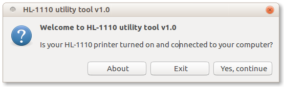
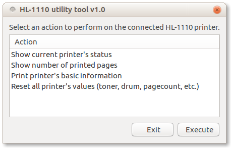
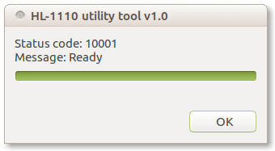

# Brother HL-1110 printer utility tool

What can I do with this?

- Get your printer's current status code (there are more than 300), and translate it to human readable messages. This will help you to better detect a problem in case you experiment strange behaviours in your printer. The remarkable types of messages are:
    - Informational messages (Ready, Warming Up, Toner low ...).
    - Operator Intervention Conditions related messages (where operator intervention may be required, e.g. 'Drum Life Out, replace Drum Kit').
    - Hardware related error messages (e.g. 'FUSER Error Cycle Power or FUSER too hot' or 'Fan Motor 1 Failure').
- Get the current amount of printed pages.
- Print basic information about printer's status and settings.
- **Reset all** printer's internal values (drum percetange, toner percentage, printed pages number, etc.). This will help you if you fill your toner cartridge manually.

## How to install

Execute the following commands to download, give execution permissions and execute the tool:
```
wget https://raw.githubusercontent.com/filisko/hl1110-utility-tool/master/hl1110-utility-tool.sh
chmod +x hl1110-utility-tool.sh
./hl1110-utility-tool.sh
```


## Preview

The main window that you will see once opened will be a simple dialog where you have to press on 'Yes, continue' button once you've got your HL-1110 printer connected to your computer.  


### Actions
And once the printer is detected after pressing the 'Yes, continue' button. The following menu will appear. Simple, right?  


#### Action 1: Show current printer's status


#### Action 2: Show number of printed pages
One toner cartdrige can print around 1000 pages before your printer says that your toner level is low (even if those pages had very low toner usage. Printer's Error LED will start to blink once in 1.5 seconds intervals, which is an indicator that we won't be able to print a lot more pages, at some point it will just stop printing. Now, there are 4 possible solutions to this 'problem'.
- Skip temporarily the warning of low toner level pressing 7 times the power button and be able to print more until it definitely stops and you can not omit it any more.
- Buy a new toner cartridge.
- Reset manually the toner cartridge moving a little gear that is located in the cartridge.
- Use this tool and reset all printer's internal values (recommended for lazy people).

So we can use the number of printed pages as an indicator of how close we are from getting warnings of low toner level and obviously to know how many pages we've printed without having to print printer's basic information.


#### Action 3: Print printer's basic information

This action will just print a page with useful information about the printer.

- This is how the printed page will look like **before** doing a reset: [press here to see the image](images/before-reset.jpg)
- TThis is how the printed page will look like **after** doing a reset: [press here to see the iamge](images/after-reset.jpg)


#### Action 4: Reset all printer's values

You should already know all about this action but one thing worth of mention is that this action is irreversible.

Once you execute this action you will get a confirmation dialog to proceed or not.


And after you've confirmed the action, it will take about 15 seconds to finish the resetting process.


### Suggestions, ideas, etc.

If you have suggestions, ideas or anything else, just write me an email (filisfutsarov@gmail.com) or create an issue in this repository.

